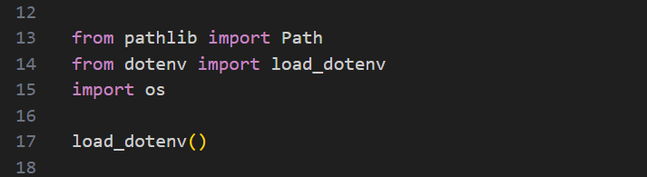

Baixar e instalar o Git
  Acesse o site oficial do Git em "https://git-scm.com/download/win".
  Clique no link para download do Git para Windows.
  Após o download, execute o instalador.
  Siga as instruções do instalador, aceitando as configurações padrão, se não for um usuário avançado.
  Conclua a instalação.

Configure seu nome de usuário e e-mail no git:
  O Git registra quem fez cada alteração no código. Portanto, é importante configurar seu nome de usuário e e-mail. Use os comandos, no terminal:
  git config --global user.name "Seu Nome"
  git config --global user.email "seu@email.com"

Instalar o Python:
  buscar em https://www.python.org/

Instalar o pip, no cmd:
  curl https://bootstrap.pypa.io/get-pip.py -o get-pip.py
  python get-pip.py

Instalar o virtualenv, no cmd:
  pip install virtualenv

Criar a venv, no terminal do projeto:
  virtualenv venv

Ativar a venv, no terminal do projeto:
  venv/Scripts/activate

Instalar Django, no terminal do projeto:
  pip install django

Sempre que instalar algum pacote no projeto, lembrar de listar as dependências e criar o requirements.txt:
  Ver dependências do projeto, no terminal do projeto:
    pip freeze
  Criar arquivo de lista de dependências, no terminal do projeto:
    pip freeze > requirements.txt

Criar o projeto, no terminal do projeto:
  django-admin startproject setup .

Iniciar o servidor do django, no terminal do projeto:
  python manage.py runserver

Configurar Idioma e Fuso horário:
  em setup/settings.py alterar LANGUAGE_CODE para 'pt-br' e TIME_ZONE 'America/Sao_Paulo'

Instalar pacote para controlar as variáveis de ambiente, no terminal do projeto:
  pip install python-dotenv

Criar arquivo .env na raiz do projeto para guardar as variáveis de ambiente que devem ser segredo:
  guardar aqui a SECRET_KEY do django

Vincular a SECRET_KEY de .env em setup/settings.py
  em setup/settings.py importar pacote: from dotenv import load_dotenv
  em setup/settings.py importar pacote: import os
  em setup/settings.py acrescentar função load_dotenv()
  
  vinculando a SECRET_KEY: SECRET_KEY = str(os.getenv('SECRET_KEY'))

Indicar os dados que não devem ser enviadas para o github:
  criar arquivo .gitignore para indicar os dados
  ir no site  gitignore.io e procurar por django, copiar o texto criado para o arquivo .gitignore

